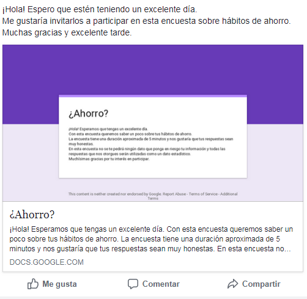

# BBVA Plan

### Objetivo

Investigar y desarrollar la oportunidad de agregar la funcionalidad de "metas compartidas" en el app de BBVA Plan. También con el objetivo de utilizarlo como una herramienta de crecimiento al buscar involucrar usuarios que no tienen BBVA Plan o una cuenta de BBVA Bancomer.

## COBRAUNIT
##### Product Owner
Samahara Fernández

##### Team UX Research
Joali Gamboa  
Ros Colunga  
May Cravioto

##### Team UX Design
Angie Rivera  
Nancy Santana  
Kartea Spirala

## ¿Qué es BBVA Plan?

BBVA Plan es una aplicación que te ayuda a crear un plan o “meta” de ahorro personalizado, escogiendo reglas de ahorro a tu gusto de manera gratuita y sin comisiones.

El servicio ofrece:
* Opción de ahorro personalizado.
* Sugerencia de ahorro personalizado de acuerdo a la meta y a los hábitos del usuario.
* Hacer uso de cualquier tipo de tarjeta débito, crédito o nómina.
* Puedes disponer del ahorro siempre que quieras.
* El plan es totalmente <strong>*GRATUITO*</strong>.

La app ofrece:
* Tener un seguimiento de tu ahorro, para conocer la cantidad que te falta para llegar a tu meta.
* Llevar control de tus movimientos y la cantidad destinada a tus ahorros.
* La meta puede ser editada.
* Escoger más de una tarjeta para ahorrar más.

## Objetivo 1: Agregar funcionalidad de metas compartidas en la app de BBVA Plan

Cuando pensamos en añadir la nueva funcionalidad de "metas compartidas" entre el equipo surgieron dudas como:
- ¿Qué hace la gente para ahorrar?
- ¿Por qué razones lo hace?
- ¿Quiénes utilizan BBVA Plan?
- ¿Quién sería capaz de utilizar una meta compartida?

Y sabiendo eso, cómo hacer que la gente confíe en BBVA Plan como un método de ahorro compartido.

Entre nuestras investigaciones nos dimos cuenta que hay muy poca cultura sobre el ahorro entre la población mexicana. Los mexicanos no ahorran y en muchas ocasiones, no es porque no tengan el poder adquisitivo, simplemente las personas no saben cómo ahorrar o para qué hacerlo.

Sin embargo, las personas ocupan otro tipo de herramientas y métodos para salir de sus apuros, cumplir con un objetivo o anticipar gastos próximos. Métodos como pedir prestamos, participar en tandas o guardar el dinero con otras personas.

Pensando en eso, dirijimos toda nuestra atención a entender lo que era BBVA Plan, y pensar en quién era el público de esta aplicación.

<!--  -->

<!--  -->

Entendiendo sobre ellos, buscar el público que creemos que podrían interesarse en la app y en metas compartidas. Para lograrlo, el equipo lanzó una primera encuesta, con el objetivo de entender a estos usuarios que aún no cuentan con una cuenta bancaria o que desconocen la existencia de BBVA Plan. Y saber un poco sobre sus hábitos de ahorro.

La encuesta fue lanzada en canales como Facebook, con un mensaje amigable para ver si creabamos interés en la gente.

[Encuesta de Google Forms](https://goo.gl/forms/h22kI5WfJ4Vkvlw72)
